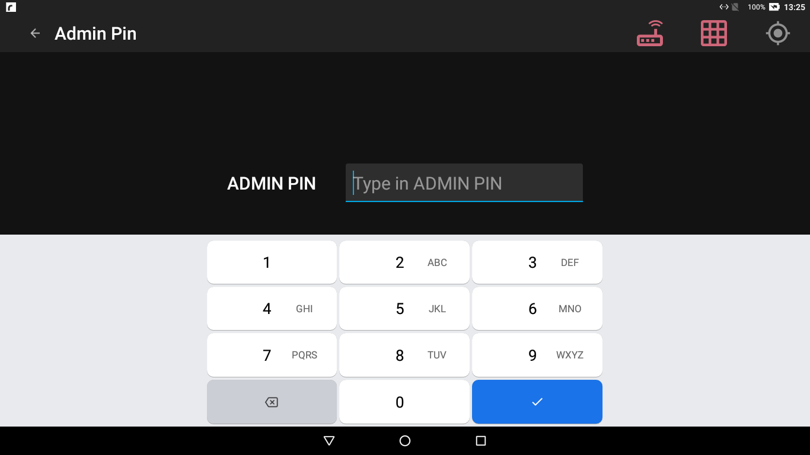
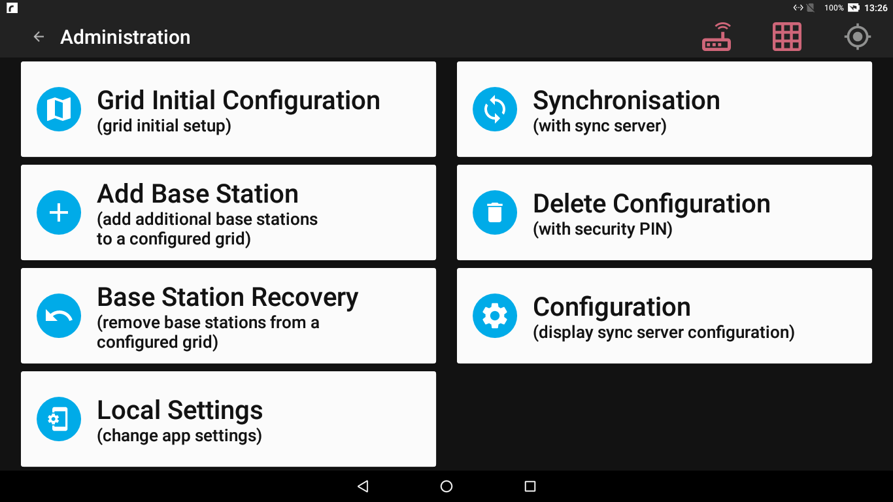
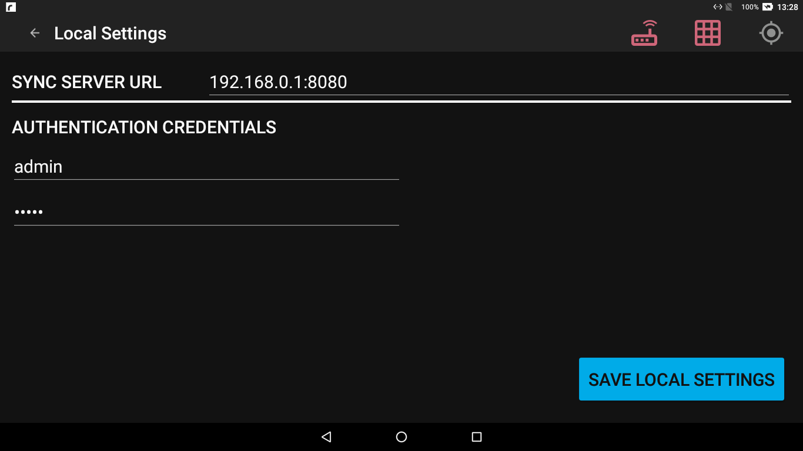
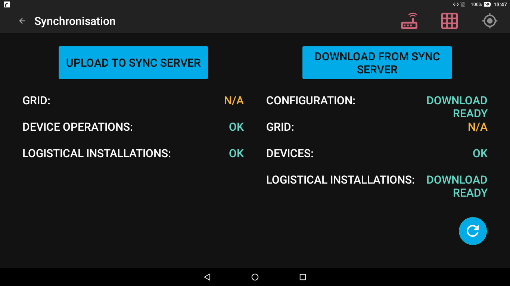
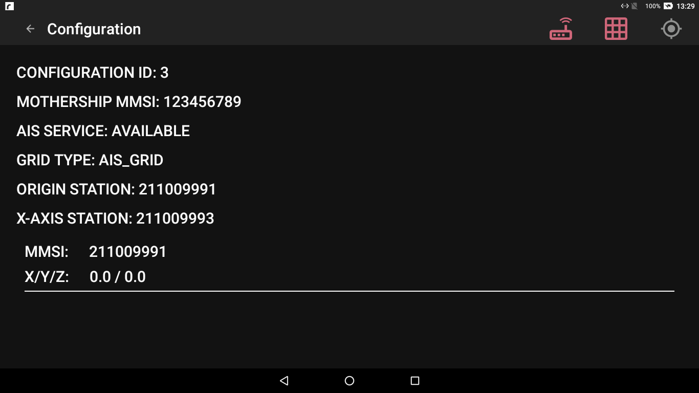
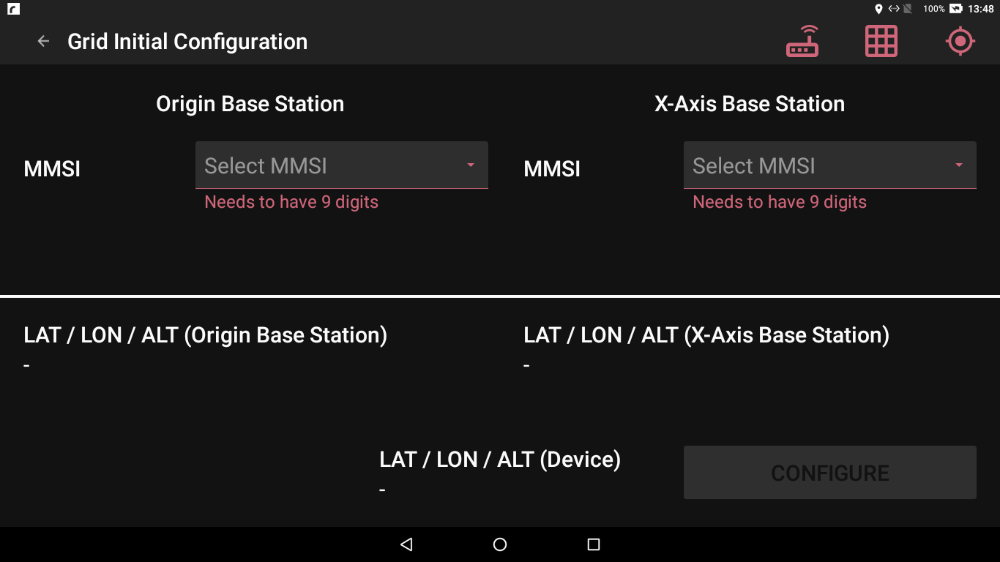
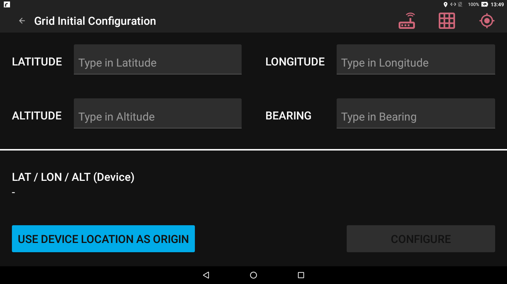
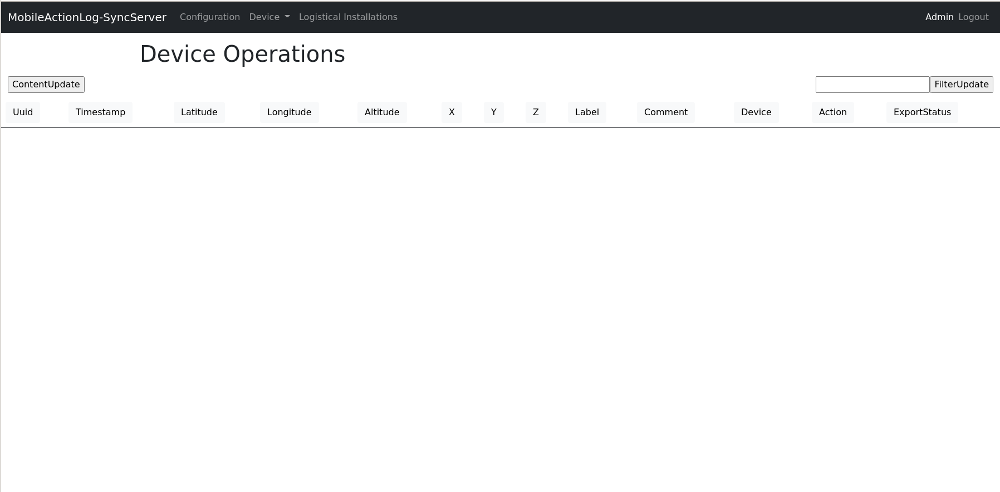
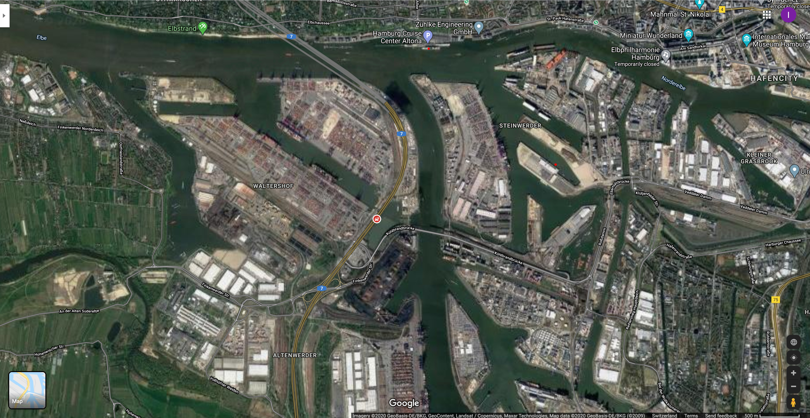
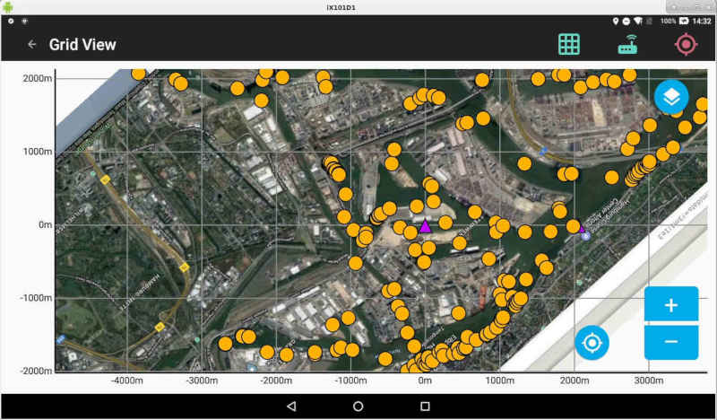

# Administration Guide

* [App administration dashboard](#app-admin)
* [Setting up the configuration and grid](#first)
  * Prepare the SyncServer
  * [Prepare the Mobile ActionLog App](#app-setup) 
  * [Grid initial configuration](#initial) 
    * [AIS Grid](#aisgrid)
    * [STATIC Grid](#staticgrid)
* [Changing the mothership MMSI, admin pin and secure pin](#change-mothership)
* [Setting up a background map image](#map)
* [SyncServer maintenance](#syncservermaintenance)
  * [Manually adding device information](#deviceinformation)
  * [Exporting device operations](#deviceoperation)
* [Tablet-Logfiles stored on the SyncServer](#tabletlog)  


## App administration dashboard {#app-admin}

{ width=800px }

The administration dashboard is protected with the admin pin.
This is the pin that is configured on the SyncServer.

**Note**: 

* If the app has never been synchronized with the SyncServer, the default password
for the admin dashboard is `0000`.

{ width=800px }

The administration dashboard allows the following operations:

* [Grid initial configuration](#initial) for an [AIS Grid](#aisgrid) or [STATIC Grid](#staticgrid).
* Adding and removing base stations for the AIS grid
* Change the [Local Settings](#localsettings), i.e. SyncServer ip, port and authentication.
* [Synchronisation](#sync) with the SyncServer
* [Delete the current configuration](#app-setup) in the app.
* Display the current [Configuration](#showconfig).

## Settings on the app {#localsettings}

{ width=800px }

In the local settings the URL of the SyncServer and the authentication information for **write** access
to the SyncServer must be configured.

**Note**: For the authentication, it is recommended to use the `writer` user/role to configure access
          to the SyncServer. The `admin` user/role should be reserved for the SyncServer UI user.

## Synchronization {#sync}

{ width=800px }

Synchronizes the configuration, the grid, device information,
device operations, and logistical installations with the SyncServer.
In the background, log files from the app are uploaded to the SyncServer.
An attempt is made to download map images from the SyncServer.

## Showing the current configuration {#showconfig}

{ width=800px }

This view shows the current configuration of the app.
In the example image shown, it an AIS grid is configured.

# Setting up the first configuration and grid {#first}

To prepare the system for logging actions, the following setup procedure is required.

If the SyncServer is initially installed and has not been used for logging, the first step can be skipped.

It is assumed, that the configuration of the SyncServer via the file `application.yaml` 
was done in the installation steps and authentication is set up accordingly.

### Disable a previous configuration in the SyncServer

Skip this task if there is no configuration on the SyncServer.

To create a new configuration, the old configuration must be deleted in the SyncServer.
This will remove device operations, logistical installations, and grid configuration from the SyncServer.
Device information will not be changed.

Deleting the grid configuration requires to log in with to the SyncServer, e.g. with the admin credentials.

The following example shows how to delete an existing configuration.

Curl example:
```bash
curl -i -X DELETE http://<username>:<password>@localhost:8080/configuration
```

Python example:
```python
import requests;
r = requests.delete('http://localhost:8080/configuration', auth=('<username>', '<password>'))
print(r.status_code)
```

A status code of "20x" is reported for a successful operation.

### Set the grid type

Two grid types are supported:

* `AIS_GRID`, using the Android app with permanent connection to an AIS transponder.
* `STATIC_GRID`, using only the Android app and a statically configured grid with fixed origin and bearing.

**Note**: To create a new configuration, the old configuration must be deleted.

The following example shows how to set up a new configuration and set it to support a STATIC grid. 
For an AIS grid, replace the element `STATIC_GRID` with `AIS_GRID` in the request.

Curl example (does not work on Windows command line):

```bash
curl -i -X POST -H "Content-Type: application/json" -d '{ "gridType": "STATIC_GRID" }' http://<username>:<password>@localhost:8080/configuration
```

Special escape codes required for Windows:

```bash
curl -i -X POST -H "Content-Type: application/json" -d "{ \\"gridType\\": \\"STATIC_GRID\\" }" http://<username>:<password>@localhost:8080/configuration
```


```python
import requests
import json

payload = { "gridType": "STATIC_GRID" }
headers = { "Content-Type": "application/json" }
r = requests.post('http://localhost:8080/configuration', headers=headers, data=json.dumps(payload), auth=('username', '<password>'))
print(r.status_code)
```

A status code of "20x" is reported for a sucessful operation.

### Prepare the Mobile ActionLog App {#app-setup}

The next step requires the Mobile ActionLog app to be synchronized with the SyncServer.
If there already exists a configuration in the app, the existing configuration must be deleted.

To delete the configuration on the app, enter the administration menu by providing the administration pin.
Select the function `Delete Configuration` and provide the additional security pin.

**Note**: Deleting the configuration and data will remove the configuration, grid setup, waypoints,
device information, and all not yet uploaded device operations and logistical installations

Return to the administration screen and enter the "Synchronization" function.
The SyncServer will offer the download of a new configuration, with a "N/A" grid.

After downloading the new configuration from the SyncServer, the app is ready to configure a new grid.
Configuration of a new grid is only possible on **one** device. 
After uploading the new grid to the SyncServer, this grid will become active for all other devices.
It is not possible to upload a new grid from a different device without deleting the configuration on the
SyncServer first.

#### Grid initial configuration {#initial}

The next steps depend on the type of configured grid:

* AIS_GRID

For the AIS grid, a connection to an AIS transponder is required.
At minimum, the MMSI of the origin station and the MMSI of the station along the x-axis is required.

* STATIC_GRID

The grid is setup by providing the coordinates (Latitude, Longitude, Altitude) of the grid origin, and
a bearing (0.0° to 359.9°). A value of 0° describes a grid that is oriented North, i.e. the x-axis is pointing East (90°).

#### AIS Grid {#aisgrid}

{ width=800px }

The grid is configured by opening the initial grid configuration view on the admin dashboard.

To use the Mobile ActionLog app, a grid needs to be configured by initially providing the MMSI of two stations:

- the origin station, which will become the origin of the grid,
  defining the position `x=0.0m, y=0.0m` on the grid
- the x-axis station, which will have the role to define
  the bearing of the x-axis of the grid.
  On the grid it will be located somewhere along the x-axis, with `y=0.0m`, and the `x`-value
  computed at each update.

The x-value of the x-axis-station position is the distance of the x-axis station from the origin station.
Currently, this distance is computed automatically and used to scale and render the background map image.

**Notes**:

- The configuration of a grid does not require a connection to the AIS-Transponder.
- It is not possible to configure a new grid, unless the configuration is deleted in the app and in the SyncServer.
- Any MMSI can be configured as the origin or x-axis station MMSI
- The origin station MMSI must be different from the x-axis station MMSI

If, within the last 10min, valid positional data was received for a station, the station MMSI
will appear in the MMSI selection list. This list is updated approximately every 15s.

The configuration view itself will also show if there is recent positional data received
from the selected station, displayed in the lower half of the screen as LAT/LON values.

However, the user may decide to accept the configuration at any time,
even if the app did not receive any data for the stations yet.

By confirming the configuration, the grid is **CONFIGURED**.
The app will start the **INITIALIZATION** in the background, and the grid status icon will
reflect the current state of the grid.

**Notes:**

- In addition to the initial grid configuration, 
  a grid can be downloaded to the app from the sync server using the sync view
  if there is currently no grid configured in the app. 
  In case there already is a grid configured in the app, the configuration needs to be deleted first.

- If a grid is downloaded from the sync server, the grid will also be **CONFIGURED**, 
  and start with the initialization phase

#### STATIC Grid {#staticgrid}

{ width=800px }

The grid is configured by opening the initial grid configuration view on the admin dashboard.

To use the Mobile ActionLog app, a grid needs to be configured by initially providing 
the latitude, longitude and altitude of the origin point (`x=0`,`y=0`), and the bearing of the grid.
A bearing of `0.0°` defines a grid that is oriented north, i.e. the x-axis points east (`90.0°`).

**Notes**:

- The configuration of a static grid does not require a connection to the AIS-Transponder.
- It is not possible to configure a new grid, unless the configuration is deleted in the app and in the SyncServer.

The configuration view allows to use the tablet position as the initial value for the origin position.

#### The initialization phase for an AIS grid

Instead of a one-time initialization phase at the time of grid configuration, the grid is using a time-window
based grid quality estimation.

- For release v3.1, a time window of 30min was defined,
  in which for each base station at least 4 valid AIS messages had to be received,
  for the grid to be considered GREEN (stable).

- After receiving feedback for release v3.1,
  the time-window was changed to 10min and 1 valid AIS message.
  Effectively, there no longer is any initialization phase.

Every time a grid interaction is triggered, i.e. receiving an AIS message with positional/movement data,
the grid quality (or accuracy) is measured. Based on the timeliness and content of the messages, the
status icon is changed.

However, the grid will always try to keep positions, bearings and drift of the grid and registered stations as
accurate as possible, based on the information that is currently available.

#### What is a valid AIS message

The AIS protocol allows for the fields in the messages to be marked as **invalid** or **unavailable**.

- A value of 360.0 degrees for the course over ground value (COG)
- A value of 102.3 knots for the speed over ground value (SOG)
- A value of 0x6791AC0 (181°) for longitude (LON)
- A value of 0x3412140 (91°) for latitude (LAT)

For the estimation of the quality of the grid, a station that is sending positional data (LAT/LON),
but not COG/SOG will be considered as if sending a full set of data. (since v3.2.1)

Even though the COG/SOG data is not available, the grid can be computed to a certain accuracy
with just the positional data (LAT/LON).

The grid will also try to display these positions anyway, as they are **mostly** accurate for a short time
after receiving the position data, but they will drift away from their **true** position quickly. This
is also indicated by a ~~RED~~ **YELLOW** grid icon (since v3.2.1).

- Typically, COG is not available if SOG is below 0.4kn (0.2m/s).
- For computation, COG and SOG is assumed to be 0 if one of the two values is not available.
  Otherwise, always assuming a course of e.g 360° would further increase the inaccuracy.
- Typically, without COG/SOG, the expected error is approx. 36m after 3min.


##### Advanced Topic: Details of the grid quality utility function

- A basic score/point system is used to measure the quality of a grid.
    - the origin station provides 200 points
    - the x-axis station provides 100 points
    - each additional station provides 100 points

- The expected score is based on the synchronized grid configuration, which is also stored at the sync server.
- The measured score is based on a communication monitor in the app that records a timestamp for the messages received from each station.
- Since v3.2.1, any message containing LAT/LON is contributing to the new score, independent of the availability of COG/SOG.
- Since v3.2.1, a new score based on the availability of COG/SOG is introduced, to distinguish between different types of DEGRADATION,
  i.e. based on missing COG/SOG, or failed stations in a redundant setup.
- If the measured score is equal to the expected score, the grid icon is colored GREEN.
- If the measured score is below 300 points, the grid icon is colored RED.
- If the measured score is equal or above 300 points, but below the expected score, the grid icon is colored YELLOW.
  This is called **DEGRADED**, as there is enough information to compute a grid, but not with data from all configured stations.

The score of 300 can be reached by configuring

- an origin station and a x-axis station (300 points)
- an origin station, x-axis-station and one additional base station (400 points)
- ...

**Notes:**

- To add additional stations, the grid needs to be setup with origin and x-axis station. For triangulation,
  the initial X/Y-position of the additional stations need to be recorded when these are added to the grid.
- The app will deny the "base station recovery" action, if the score would fall below 300 points.
- Not all possible scenarios can be synchronized with the sync server
- Not all possible scenarios are supported by the grid drift-calculation algorithm

**Example**

_Setting up a nominal grid_

- Origin station: 200 points
- X-Axis station: 100 points

This is most basic valid configuration, because the configuration provides 300 points.
Initially, the grid icon is RED.
A few of the possible scenarios:

- If the grid has received valid data for the origin station,
  and now receives a valid datum for the x-axis station,
  the color of the grid icon is set GREEN.

- If the grid has received a valid datum for the x-axis station,
  but the communication monitor has not recorded
  a valid datum from the origin station within the last 10min,
  the color of the grid icon is set RED.

The grid is updated in all cases, and will display the stations and icons.
However, the accuracy of the computation degrades with the age of the last valid message, as the
position of a station is extrapolated from the last received LAT/LON and COG/SOG values.


_Adding a base station to the grid_

- Additional Station S1: 100 points

The configuration now provides 400 points. Initially, the grid icon is RED.
A few of the possible scenarios:

- If the grid has received valid data for the origin station,
  and now receives a valid datum for the x-axis station,
  the color of the grid icon is set YELLOW.
  The grid is fully functional, but there is no data for station S1.

- If the grid has received valid data for the origin and x-axis station,
  and now receives a valid datum for the additional station S1,
  the color of the grid icon is set GREEN.

- If the grid now receives a valid datum for the origin station,
  but the last recorded message for the x-axis station has been 15min ago
  and the last recorded message for station S1 has been 10s ago,
  the grid icon is set YELLOW.
  Since the data for station S1 is more current than the x-axis station,
  the grid bearing is reconstructed from the last recorded bearing between origin and S1 and the
  X/Y-position of S1 on the grid. Additional stations increase the accuracy, especially if they
  are spaced further apart.


## SyncServer tablet log {#tabletlog}

Every time a tablet is synchronized with the SyncServer, the tablet will transfer up to 10MB
of the latest recorded log messages to the SyncServer.

For the tablet log files, a dedicated folder `tablets` is created in the log directory.
For each tablet, the name of the logfile is generated from the unique Android-ID of the tablet
and a timestamp.

The files are plain text files with timestamped messages,
which can easily be split into smaller parts and
compressed with ZIP or 7-Zip with a very high compression ratio.

The following list contain messages indicating typical issues.

### Connection issues

- The tablet is on a network where host 192.168.0.1 is available, but is not responding to requests on port 2000:

```
AisServiceRunnable: java.net.ConnectException: failed to connect to /192.168.0.1 (port 2000) after 2500ms: isConnected failed: ECONNREFUSED (Connection 
refused)
```

- The tablet is not connected to a network, or connected to a local (un-routed) network without access to 192.168.0.1:

```
AisServiceRunnable: java.net.ConnectException: failed to connect to /192.168.0.1 (port 2000) after 2500ms: connect failed: ENETUNREACH (Network is unreachable)
```

- The tablet has not received any messages on the connection to the AIS transponder located at 192.168.0.1 for 30s:

```
AisServiceRunnable: java.net.SocketTimeoutException
```

- The connection to the SyncServer failed:

```
SynchronisationViewModel: java.lang.RuntimeException: java.net.ConnectException: Failed to connect to /10.0.2.2:8080
```

### Received AIS messages

- A **good** message
    - This transponder probably connects to a compass and log, and does not use GPS for speed and course
    - The SOG of 0.0kn is a correct value, in AIS a value of 102.3 means unavailable, the decoder will log a value of null instead.

```
AisServiceRunnable: Received line: !AIVDM,1,1,,B,139KSs0v@00eWWjN`;A`D8NN00RB,0*24
AisServiceRunnable: Decoded geo info mmsi: 211215340, position: (lat:53.5258766667 lon:9.9656416667), movement: (sog:0.0 cog:212.8)
```

- A message missing COG and SOG

```
AisServiceRunnable: Received line: !AIVDM,1,1,,A,139a8jPP010eU=JN`p8>4?vL0<3g,0*69
AisServiceRunnable: Decoded geo info mmsi: 211437770, position: (lat:53.5450133333 lon:9.9574083333), movement: (sog:null cog:null)
```

- A message missing LAT/LON and COG and SOG

```
Received line: !AIVDO,1,1,,,B39>ab03wk?8mP=18D3Q3wwQhP00,0*7D
Decoded geo info mmsi: 211003816, position: (lat:91.0 lon:181.0), movement: (sog:null cog:null)
```

- A **good** message containing voyage data (vessel name)

```
AisServiceRunnable: Received line: !AIVDM,2,1,2,B,539q8nT00000@SO37<0<58j0HD@@E9<Dp000001S1`42240Ht00000000000,0*10
AisServiceRunnable: Decoded name info mmsi: 211699930, name: CARL FEDDERSEN
```

- Some messages cannot be decoded, but this should not be an issue
    - These appear to be AIS transponder housekeeping messages

```
AisServiceRunnable: Received line: $AIALR,083852,002,A,V,AIS: Antenna VSWR exceeds limit*78
AisServiceRunnable: de.awi.floenavi.ais.decoder.AISDecoderException: Message TalkerID is not an AIVDM/AIVDO id, must start with '!': $AIALR
```

```
AisServiceRunnable: Received line: $AIALR,100002,007,A,V,AIS: UTC sync invalid*2D
AisServiceRunnable: de.awi.floenavi.ais.decoder.AISDecoderException: Message TalkerID is not an AIVDM/AIVDO id, must start with '!': $AIALR
```

```
AisServiceRunnable: Received line: $AIALR,100003,026,A,V,AIS: no position sensor in use*71
AisServiceRunnable: de.awi.floenavi.ais.decoder.AISDecoderException: Message TalkerID is not an AIVDM/AIVDO id, must start with '!': $AIALR
```

```
AisServiceRunnable: Received line: $AIALR,100003,029,A,V,AIS: no valid SOG information*74
AisServiceRunnable: de.awi.floenavi.ais.decoder.AISDecoderException: Message TalkerID is not an AIVDM/AIVDO id, must start with '!': $AIALR
```

## Changing the mothership mmsi, admin pin and security pin {#mothership-mmsi}

The initial settings for a configuration is read from the `application.yaml` file.
After a configuration is created, the fields can be updated directly via the REST endpoint:

```bash
curl -i -X PATCH -H "Content-Type: application/json" -d '{ "mothershipMmsi": "135792469", "adminPin": "1111", "securityPin": "4444" }' http://<username>:<password>@localhost:8080/configuration
```

On Windows, characters need to be escaped differently:

```bash
curl -i -X PATCH -H "Content-Type: application/json" -d "{ \\"mothershipMmsi\\": \\"135792469\\", \\"adminPin\\": \\"1111\\", \\"securityPin\\": \\"4444\\" }" http://<username>:<password>@localhost:8080/configuration
```


### Change the device operations export flags on the SyncServer {#operations-flags}

To support the requirement of blocking device operations from export to the
DSHIP proxy system, the database table managing the device operations supports
an additional field: `export_status` in table `operation`.

The allowed values for this field are:

- `PENDING`: The device operation was synced from the tablet and is ready for export
- `EXCLUDED`: This device operation will not be exported
- `EXPORTED`: The device operation was retrieved by the DSHIP proxy and will not be exported again.

Alternatively, the SyncServer UI can be used to change the export flags.

{ width=800px }

In the UI, the field `ExportStatus` can be changed for each of the entries in the list.
To store the changes in the database, use the button `ContentUpdate`.
The user must be logged in as an administrator to make changes to the content of the database.

### Deleting device information {#delete-information}

Device information stored on the sync server can be deleted (flagged as `DELETED`),
and as such they are no longer visible in the FloeNavi app.

These device information do not get physically deleted from the database,
therefore the integrity of the database stays intact.

Using the device information update workflow,
any device for which an update is received will be undeleted.

#### Example

Deleting the device with the device id `1`:

```
curl --verbose --request DELETE --url http://<username>:<password>@10.0.2.2:8080/devices/1
```


## Grid background map image support {#map}

Displaying a background image in the app is supported for both AIS and STATIC grid mode.
The functionality is however currently limited to pixel-referenced images.

Due to the stations drifting over time, approaches with bounding box geo-referenced images is not
possible in AIS grid mode.

### Basic requirements for the image

Displaying the image in the background requires to rotate and scale the image such that it fits
to the coordinates available for the grid.

For this, the x/y pixel coordinate of the origin position **inside** the image is required.

Second, the image need to be rotated and scaled, such that it aligns with the x-axis of the grid.

For this, the x/y pixel coordinate of the x-axis station **inside** the image is required.

This functionality is also available for STATIC grid.
Instead of a physical x-axis station, a virtual x-axis station with a distance of 100m to the origin
is used.

### Example configuration for a AIS grid

Displaying a map image in the app requires two files to be stored in an admin-defined
directory on the SyncServer host.
The directory used for providing those files is configured in the `application.yaml` file with the keyword `maps`

The files need to be placed in the folder for "Maps" configured during installation of the SyncServer.

#### 1. The map image file `map.jpg`

- This must be a standard JPEG file.
- The app was tested with a jpg of dimension 3353x1731 pixels and 4MB size.
  Images with 12Mpx (4000x3000) or higher should also be possible but are not officially supported.
- The position of the origin and x-axis station need to be locatable in the image.

{ width=800px }

On the example map:
- The origin station is AIDAperla (red dot at Steinwerder Quay, right of center),
- the x-axis station is Europa2 (red dot at hamburg cruise center, center and top border).

#### 2. The image configuration file `map.info`

- The file contains the pixel coordinates of the two stations

For the example map:
```
origin 2300 681
x-axis 1774 201
```

- origin is at x=2300, y=681
- x-axis is at x=1774, y=201

The position `x=0`, `y=0` is the top-left corner of the image

#### 3. Removing the map image

- Remove the files from the map directory on the SyncServer
- Perform a sync (download) from the SyncServer

If there is no image in the map directory on the SyncServer,
the map image on the app will be deleted.

{ width=800px }

### Differences for a STATIC grid

There is no x-axis station in a STATIC grid.
Therefore, the reference length for the scaling factor is fixed to 100m.

If the grid bearing is 0°, and the image is also oriented north, the `map.info` could be:

- image resolution 1m per pixel
- origin at x=2300, y=681
```
origin 2300 681
x-axis 2400 681
```

- image resolution 2m per pixel
- origin at x=2300, y=681
```
origin 2300 681
x-axis 2350 681
```

This is only a workaround to also support map images in STATIC mode. Hopefully, the GIS tools allow
to e.g. draw a 100m reference x-axis element into the map image before export, which would help locating
the x/y image coordinates for both origin and virtual x-axis station.

# Manually adding device information {#deviceinformation}

A device can be imported using the following curl command.

```bash
curl --request POST --url http://localhost:8080/devices 
--header "content-type: application/x-www-form-urlencoded" 
--data DEVICE_ID=6180 
--data "DEVICE_NAME=seawater tap" 
--data DEVICE_SHORT_NAME=seawatertap_ps 
--data "DEVICE_TYPE=Water Sampler" 
--data "ACTIONS=hoisting,in the water,information,lowering,on deck" 
```

If the FloeNavi SyncServer is running then you should get HTTP status code 200. You can check if the device is actually imported by synchronizing a tablet with the FloeNavi App or running the following curl command.

```bash
curl --request GET --url http://localhost:8080/devices 
--header "Accept: application/json"
```

You should get the following output or something similar.

```bash
curl --request GET --url http://localhost:8080/devices 
--header "Accept: application/json"

[ {
  "id" : 6180,
  "name" : "seawater tap",
  "shortName" : "seawatertap_ps",
  "type" : "Water Sampler",
  "actions" : [ "information", "lowering", "on deck", "in the water", "hoisting" ]
} ]
```

# Export device operations {#operationexport}

Before you can export some device operation you have to capture them. First we have to capture some device operations in the FloeNavi App and second the the tablet with the FloeNavi has to be synchronized with the FloeNavi SyncServer.

After some device information have been created you can export these device information as CSV using this curl command

```bash
curl --request GET --url http://localhost:8080/operations
```

You should get an output similar to this one

```bash
curl --request GET --url http://localhost:8080/operations  
2020-05-11T14:56:47.016Z;87.823389;90.027728;40023.384966016325;6649.390883474067;ds lead;refrozen lead. 0cm snow. old frost flowers;6180;1;lowering
2020-05-11T14:57:20.885Z;87.823389;90.027728;40023.384966016325;6649.390883474067;ds lead;refrozen lead. 0cm snow. old frost flowers;6180;2;hoisting
```
