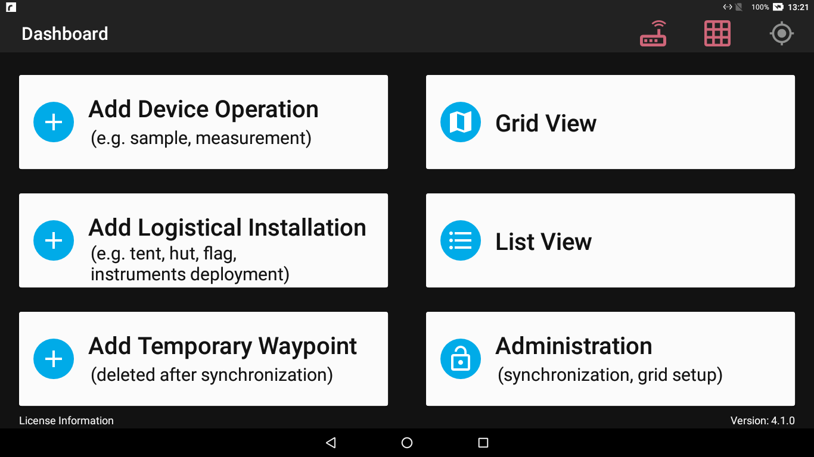
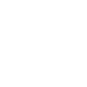
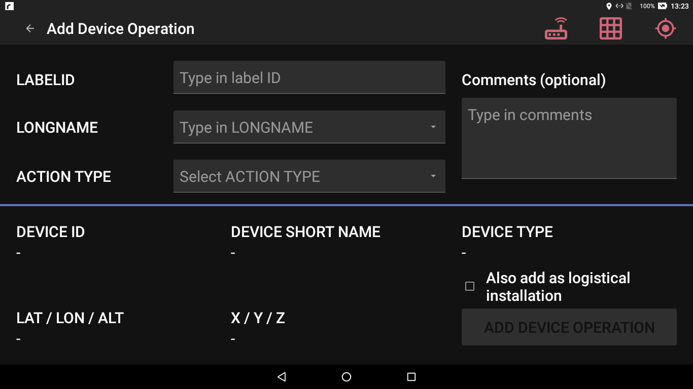
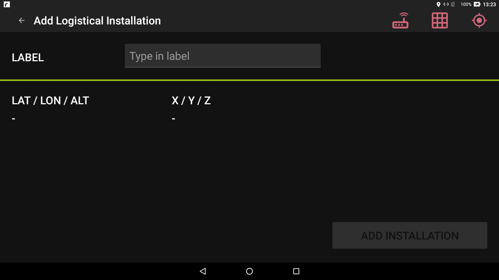
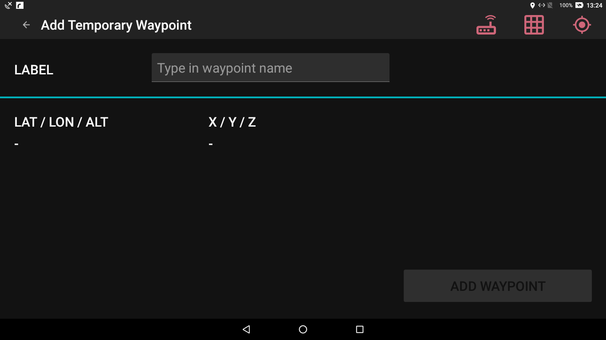
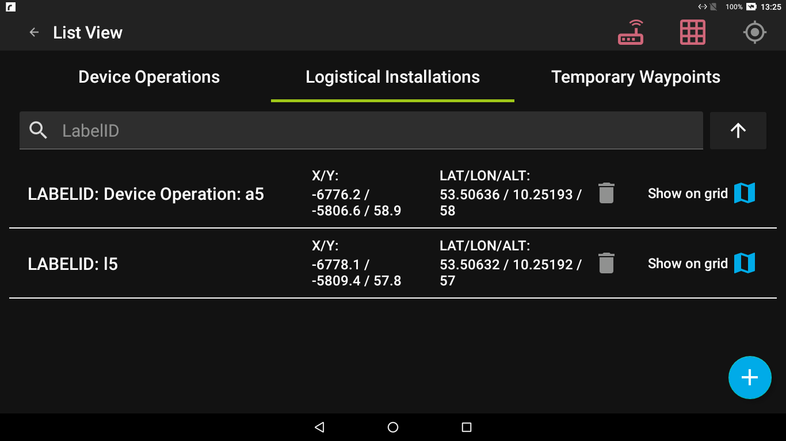
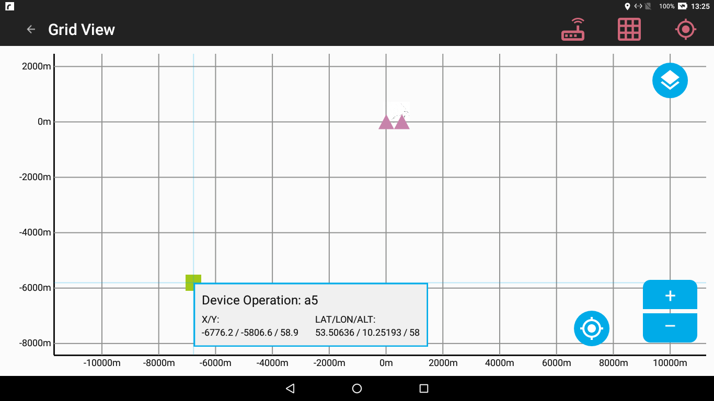

--- DRAFT ---

* [Migration from pre-v2-FloeNavi](#prologue)
* [Dashboard](#dashboard)  
* [Grid status icon](#grid-status)
* [Grid status messages](#status-messages)  
* [Connection to the AIS Transponder](#ais-transponder)

# Prologue for users of the original FloeNavi app {#prologue}

The FloeNavi app was developed using concepts and algorithms previously developed for the [FloeNavigation project](https://github.com/floenavigation).
The admin manual of the predecessor app provides an introduction for the concepts of the grid, and the role of the
different base stations (origin, x-axis, additional stations).

The behaviour of the FloeNavi app and SyncServer deviates from the previous implementation, to either fix issues in the
original implementation, or to improve the workflows w.r.t to the received feedback, UI changes and new requirements.

## Short list of possible, noticeable and visible differences to the old app behaviour

The nominal use case requires a grid built from an AIS base station at the origin position (x=0,y=0)
and a station defining the bearing of the x-axis, called x-axis station.

If these two stations are available and have sent their LAT/LON positions at least once,
the app **will** compute a grid and display positions in the grid view.

The color of the grid status icon is an indicator for the accuracy (or usability) of x/y positions computed for the grid.

In the nominal case, with an origin station, and an x-axis station,
the icon is GREEN **only** when

- both stations have sent a datum  containing latitude and longitude (LAT/LON),
- course over ground, and speed over ground (COG/SOG) values, and
- the datum was received not longer than 10min ago.

The app will always use the latest received data from each station.
The grid view popup for each station will always show the latest received LAT/LON positions.

**NOTE:**

If COG/SOG values for a station are available, the app will extrapolate a new position (LAT/LON) based on the
last received datum, and the elapsed time since the last message was received.

If the SOG/COG values are not available, the positions of the stations on the grid view **WILL** visibly jump,
with each update, unless the ice is absolutely not moving, or the app is used on solid ground.

For the X/Y positions in the grid view, the app always computes
the drift-applied **estimated** origin position and bearing of the grid,
before translating a LAT/LON position of a mobile station, or the tablet's own position into X/Y coordinates.

The app does not iteratively compute the positions of stations at fixed intervals, but only at specific events:

- the app receives a message with LAT/LON and optionally SOG/COG for a base-station, typically every 3min
- the app receives a message with LAT/LON and optionally SOG/COG for a mobile station,
  typically every 3min, maybe faster if the station is moved,
  or is sending at shorter intervals (mothership).
- the tablet requests an update of its own X/Y position.
  This is triggered at regular intervals and when the located tablet position has moved a certain distance.

Starting point for the drift-related extrapolation of positions is always the last received datum.

This approach was chosen for multiple reasons:

- event based processing reduces the resource usage in many scenarios.
- the app translates the LAT/LON position the instant it receives an AIS message for a station, and not after some, albeit short, waiting time.
  The grid view immediately updates and shows the new position of that station.
- removing the errors introduced by re-using the result of previous computations, because of e.g. rounding errors.
- Android is not a real-time system, the interval at which the Android system calls a service is not guaranteed.
- If the tablet or the app is inactive, stopped, sleeping, shut down, resetting, or otherwise interrupted,
  the app will start from the last received datum,
  and apply the positional drift correction based on the elapsed time since then.
  The app will not continue from an old result produced before the interruption.
- Opening the grid view will trigger an update of the grid positions and station positions (since v3.1)

# Dashboard {#dashboard}

{ width=800px }

The dashboard allows the following user interactions:

* Add [device operation](#operation)
* Add [logistical installation](#installation)
* Add a [temporary waypoint](#waypoint)
* Show the [grid view](#grid)
* Show the [list view](#list)
* Switch to the [administration](ADMIN_GUIDE.html) dashboard (protected by a pin)

The following status icons are shown in the top right corner of the screen:

* The connection status of the [AIS transponder](#ais-transponder).
  {width=64px}

* The [status of the grid](#grid-status).
  {width=64px}
  
* An indicator when acquiring the [device position](#gps-status) via builtin GNSS.

# Grid status icon {#grid-status}

## For AIS grids

**Notes:**

- When starting the app, the grid status icon will always be red.
- The status icon shows the **current** state of the grid,
  it is an indicator for the quality of the data used to compute positions,
  bearings and drift of the grid and registered stations on the grid.

The following color indicators are supported by the status icon:

- RED: (**LOST** grid)

    - the grid is not yet configured
    - the grid has not received valid data for enough base station on the grid within 10min.

- YELLOW: (**DEGRADED** grid)

    - the grid has not received data for each base station on the grid within 10min, but it has
      enough data to reliable compute a grid from data that was received within 10min, i.e. because additional stations have been added.
    - the grid will not follow the ice drift and stations may jump with each update,
      because incomplete data (i.e. missing COG/SOG) was received for a base stations
      (in v3.2 this scenario was considered **LOST** and showing RED icon)
    - It is dangerous to add or remove stations from the grid in this state.

- GREEN: (**NOMINAL** grid)

    - the grid has received complete data for each base station (origin, x-axis and additional) within 10 min.

## For STATIC grids

- RED: (**UNDEFINED** grid)

  - the grid is not yet configured

- GREEN: (**NOMINAL** grid)

  - the grid is configured with origin and bearing.

# Add Device Operation {#operation}

{width=800px}

* The `LABELID` is a free text field.
* `LONGNAME` and `ACTION TYPE` are part of the configured device information downloaded from the SyncServer.
* Device operations can be added at any time, even if there is **NO** grid available.
* The minimum requirement for adding device operations is the availability of a GNSS fix, as
  the record must be made with the device's current position.
* The checkbox marked `add as logistical installation` creates a logistical installation at the same position.
  This position can then be synchronized to other devices via the SyncServer.
* Device operations are not displayed on the grid view.

# Add Logistical Installation {#installation}

{width=800px}

* A logistical installation is a record that is displayed on the grid view.
* Installations are synchronized with other devices via the SyncServer.
* Records of this type can be made even if there is **NO** grid available.
* The minimum requirement for adding logistical intallations is the availability of a GNSS fix, as
  the record must be made with the device's current position.

# Add Temporary Waypoint {#waypoint}

{width=800px}

* Temporary waypoints are records of the device's current position in the grid.
* Without a grid, waypoints do not work.
* Waypoints are **not** synchronized with other devices via the SyncServer.
* All waypoints are deleted when a synchronization is performed.

# List View {#list}

{width=800px}

All logged device operations, logistical installations and waypoints are visible in this list.
The arrow controls the sorting order of the entries.

The function `Show on grid` is only visible, if a grid is available and the installation was also
recorded with grid coordinates (X/Y/Z).

# Grid View {#grid}

{width=800px}

* Logistical installations are shown as squares. A logistical installation,
  created on request when adding a device operation is shown in the above example.

* The legend icon in the top right corner will show an overview of the symbols and their meaning.
  
* For AIS grids, the following two additional icons are shown:

| Icon  |   |
|-------|---|
| {width=32px} | Base Station|
| {width=32px} | Mothership |

* On all grids, waypoints are displayed:

| Icon  |   |
|-------|---|
| {width=32px} | Temporary Waypoint |

# Grid and station messages (AIS grid) {#status-messages}

The grid algorithm and communication monitor will emit **ALERTS** that are displayed in the grid view.
Such an alert can be triggered by any update to the grid algorithm,
i.e. any message received from the AIS transponder, or a scheduled grid re-calculation request
to update the grid view and icon positions (typically performed when the tablet moves a certain distance).

The app uses an event-driven mechanism. If an AIS message is received for a specific station,
this event also triggers e.g. a full scan of the communication log, and for any station that has not sent a
message since 10min, a LOST-event is sent to the grid view, which will react by removing these stations from the grid.

Therefore, the time displayed in the LOST alert message may not be exactly 600s, which is the defined timeout, but
any number larger than this value, depending on the activity of the tablet.

## Station LOST

`No data received from AIS Station xxxxxxxxx since xxxxx seconds`

The grid algorithm has detected, that a station has not sent any communication since 10min.
This station is than marked as offline and will no longer be displayed on the grid until
a new message is received.

## Station not sending COG/SOG

`Station xxxxxxxxx has not sent a COG/SOG datum`

The station has sent a message including LAT/LON position, but without COG/SOG data.
If the station is a base station, the grid will be inaccurate and the grid status is decreased to at least YELLOW (degraded).
However, the grid will still be calculated with available data from the LAT/LON position. and data from other stations.

# Connection to the AIS transponder {#ais-transponder}

On the tablet, a dedicated service is maintaining the connection to the AIS transponder.
This service does appear in the Android top action bar as an Icon with the title "FloeNavi App - AIS service running".
The AIS service is running in the background, independent of the FloeNavi app.

## Connection Details

- Every 2.5s the AIS service is trying to establish a connection to the AIS transponder, if there is no
  existing connection.
- If the AIS service does not receive a message on the connection to the AIS transponder for 30s, it forcefully
  terminates the connection and tries to re-connect.
- The AIS service does not have access to the WLAN or Ethernet settings on the tablet.
- The AIS service always connects to port 2000 on ip address 192.168.0.1.

**Notes:**

- If a connection is interrupted and is not re-established automatically, the system must wait for a timeout to occur.
    - The default timeout on Android is 2h. The FloeNavi app uses a modified timeout of 30s
    - If the AIS network is very quiet, i.e. a window of 30s in which no transponder sends a message, the app may trigger a timeout
      even though the connection to the AIS transponder is stable.
    - The AIS transponder also has a timeout on TCP connections, the exact length of the timeout is not known.
        - The timeout on the AIS transponder seems to be in the range of a few minutes

- It was observed, that Android sometimes disconnects from a WLAN if the access point does not provide internet access,
  and other WLANs are available. In such a case, Android sends a notification with a request to confirm that the WLAN without
  internet access should be used anyway. This decision can be made "permanent" so that in the future the WLAN is automatically used.
    - One of the two tablets in the test did not allow to make this decision "permanent" and repeatedly dropped the connection every time
      a network change occured, i.e. leaving the WLAN range for a moment

# GPS status icon {#gps-status}

Locating the tablet with the tablet built-in GPS receiver is a time and resource consuming operation.
Therefore, the tablet uses the GPS only when required, and this is reflected by the GPS status icon.

- The tablet does not constantly try to acquire a GPS fix.
    - Google services provide a helper library for GPS services, but from feedback it was understood that
      not all tablets have the correct update of the google services installed.
- On screens that do not require a GPS fix, the GPS status icon is GREY.      
- The GPS status icon is RED by default, the icon will be updated when the app shows a view that 
  requires a GPS fix:
    - the grid view
    - adding logistical installations
    - adding waypoints
    - adding device operations
    - adding a base station
    - initial grid configuration

The FloeNavi app requests the GPS position of the tablet on screens that require a GPS fix.
When the position is established, the GPS status icon on that view changes from RED to GREEN.
Once in this state, the tablet periodically requests a new GPS fix in the background to update the position.

On pages that do not require the tablet position,
i.e. Dashboards, Sync View, List Views, the GPS status icon will permanently stay GREY.

